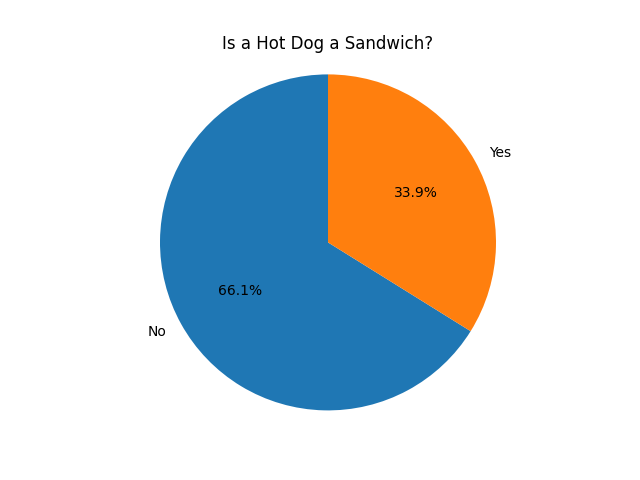

# Do UVA undergrads think hotdogs are sandwiches?
## Provenance
This data was collected from UVA undergraduates via a google form survey consisting of 4 questions:

1. Name? (Text box input)
2. Are you an undergraduate student at UVA? (Yes/No)
3. Major? (Text box input)
4. Is a hotdog a sandwich (Yes/No)

The survey was created by a class representative from the $001$ section of DS-$4002$ on 08/28/26, and distributed by students over the weekend to collect data.

## Data dictionary
| Attribute                                | Type   | Description                                                    |
| ---------------------------------------- | ------ | -------------------------------------------------------------- |
| Name                                     | String | Name of the student filling out the form                       |
| Are you an undergraduate student at UVA? | Yes/No | If the student filling out the form is a current UVA undergrad |
| Major                                    | String | Major of the student filling out the form                      |
| IS A HOT DOG A SANDWICH?                 | Yes/No | Indicates if the student believes a hotdog is a sandwich       |

## Exploratory plots

## Quantification of uncertainty

- not sure ran out of time!

## Conclusions
